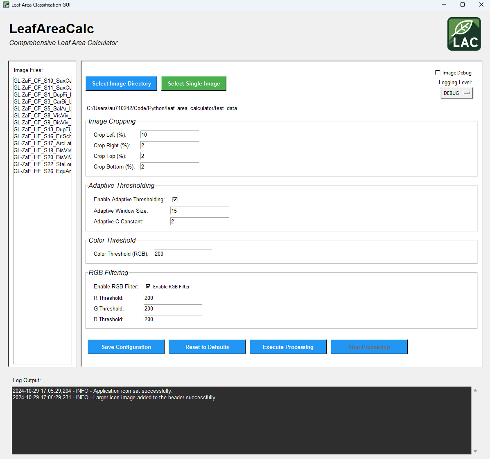

# LeafAreaCalc


## Table of Contents
- [Introduction](#introduction)
- [Features](#features)
- [Installation](#installation)
- [Configuration](#configuration)
- [Usage](#usage)
  - [Graphical User Interface (GUI)](#graphical-user-interface-gui)
  - [Command-Line Interface (CLI)](#command-line-interface-cli)
- [Logging](#logging)
- [Contributing](#contributing)

## Introduction

**LeafAreaCalc** is a comprehensive tool designed for accurate leaf area classification from digital images. LeafAreaCalc provides an intuitive interface and powerful processing capabilities to streamline your leaf analysis workflow, whether you're a botanist, researcher, or hobbyist.


## Features

- **Adaptive Thresholding in RGB Space:** Enhance leaf detection by excluding near-white non-leaf areas immediately after cropping.
- **Configurable Cropping:** Adjust cropping percentages to focus on specific regions of interest within your images.
- **Contrast Adjustment:** Optionally apply CLAHE (Contrast Limited Adaptive Histogram Equalization) to improve image contrast.
- **Morphological Operations:** Refine binary images using morphological closing with adjustable kernel sizes and iterations.
- **Contour Detection:** Accurately identify and count leaf contours, calculating their respective areas.
- **Mean RGB Calculation:** Compute average RGB values within detected leaf areas for color analysis.
- **Graphical User Interface (GUI):** User-friendly interface for configuring settings, selecting directories, and monitoring processing.
- **Logging:** Comprehensive logging with adjustable verbosity levels to track processing steps and debug issues.
- **Image Preview:** Preview images directly within the GUI for easy verification.
- **Configuration Management:** Save and reset configurations with ease, ensuring reproducible results.



## Installation

### Prerequisites

- **Python 3.6+**: Ensure you have Python installed. You can download it from [python.org](https://www.python.org/downloads/).
- **Virtual Environment (Recommended)**: It's advisable to use a virtual environment to manage dependencies.

### Steps

1. **Clone the Repository**
   
   ```
   git clone https://github.com/yourusername/LeafAreaCalc.git
   cd LeafAreaCalc
   ```


2. **Create and Activate Virtual Environment**

    ```
    python -m venv venv
    # On Windows
    venv\Scripts\activate
    # On Unix or MacOS
    source venv/bin/activate
    ```

3. **Install Dependencies**

Once your virtual environment is activated, install the necessary Python packages by running the following command:

    ```
    pip install -r requirements.txt
    ```

4. **Verify Installation**

Ensure that all dependencies are installed correctly by running:

    ```
    python src/gui_leaf_area_classification.py
    ```

## Configuration

LeafAreaCalc uses a configuration file (config/config.ini) to manage processing parameters. This file allows you to customize various aspects of the image processing pipeline.

### Configuration File Structure
    ```
    [DEFAULT]
    # Directory containing leaf images
    image_directory = C:/Path/To/Your/Images

    # Processing parameters
    # Minimum leaf area in mm² to consider
    area_threshold = 10

    # Skip contrast adjustment (True or False)
    skip_contrast_adjustment = False

    # Save intermediate images (True or False)
    img_debug = False

    # Cropping percentages
    # Percentage to crop from the left
    crop_left = 20

    # Percentage to crop from the right
    crop_right = 3

    # Percentage to crop from the top
    crop_top = 3

    # Percentage to crop from the bottom
    crop_bottom = 3

    # Specific filename to process (leave empty to process all images)
    filename =

    # Adaptive Thresholding Parameters
    # Enable or disable adaptive thresholding (True or False)
    adaptive_threshold = True

    # Window size for adaptive thresholding (Must be an odd integer)
    adaptive_window_size = 15

    # Constant subtracted from mean in adaptive thresholding
    adaptive_C = 2

    # RGB value above which pixels are considered near-white
    color_threshold = 240

    # Morphological Closing Parameters
    # Kernel size for morphological closing (width,height)
    kernel_size = (5, 5)

    # Logging
    # Options: DEBUG, INFO, WARNING, ERROR, CRITICAL
    log_level = DEBUG
    ```

### Editing Configuration

**Manual Editing:** You can manually edit config/config.ini using any text editor to adjust parameters.
**GUI Configuration:** The GUI provides options to modify these settings with explanations and default values.

### Parameter Explanations

- **image_directory:** Path to the folder containing your leaf images.
- **area_threshold:** Minimum area (in mm²) for a contour to be considered a valid leaf.
- **skip_contrast_adjustment:** If set to True, skips the CLAHE contrast adjustment step.
- **img_debug:** If True, saves intermediate images for debugging purposes.
- **crop_left, crop_right, crop_top, crop_bottom:** Percentages to crop from each side of the image to focus on the region of interest.
- **filename:** Specify a particular image file to process. Leave empty to process all images in the directory.
- **adaptive_threshold:** Enables adaptive thresholding in RGB space to exclude near-white areas.
- **adaptive_window_size:** Window size for calculating the local mean in adaptive thresholding. Must be an odd integer.
- **adaptive_C:** Constant subtracted from the mean in adaptive thresholding to fine-tune thresholding.
- **color_threshold:** RGB value above which pixels are considered near-white and excluded from leaf detection.
- **kernel_size:** Size of the structuring element for morphological closing. Must be a tuple of two integers, e.g., (5,5).
- **log_level:** Sets the verbosity of logging output. Options include `DEBUG`, `INFO`, `WARNING`, `ERROR`, `CRITICAL`.

## Usage

LeafAreaCalc offers both a Graphical User Interface (GUI) and a Command-Line Interface (CLI) for flexibility.

### Graphical User Interface (GUI)
1. Launch the GUI

    ```bash
    python src/gui_leaf_area_classification.py
    ```

2. Select Image Directory
- Click on the "Select Image Directory" button.
- Choose the folder containing your leaf images.

3. Configure Settings
- Adjust processing parameters as needed.
- Each parameter includes an explanation and default value.

4. Execute Processing
- Click on the "Execute Processing" button to start analyzing the images.
- Monitor the progress and logs in the enlarged output panel at the bottom.

5. View Results
- Processed images with annotations will be saved in the `result_img/` folder within your image directory.
- Intermediate images (if enabled) will be saved in the `intermediate_img/` folder.

6. Stop Processing
- Click on the "Stop Processing" button to terminate an ongoing analysis.

### Command-Line Interface (CLI)
For users who prefer command-line operations, LeafAreaCalc can be executed directly:

    ```bash
    python src/leaf_area_classification.py
    ```
Note: Ensure that all necessary parameters are set in the `config/config.ini` file before running the CLI.

### Logging
LeafAreaCalc provides detailed logging to help monitor processing and debug issues.

#### Adjusting Logging Level
- Via GUI: Use the "Logging Level" dropdown menu to select the desired verbosity.
- Via Configuration File: Edit the log_level parameter in config/config.ini to one of the following:
    - `DEBUG`
    - `INFO`
    - `WARNING`
    - `ERROR`
    - `CRITICAL`

#### Log Output
Logs are displayed in the GUI's log output panel and saved to `leaf_analysis.log` in the image directory.

## Contributing
Contributions are welcome! If you'd like to contribute to **LeafAreaCalc**, please follow these steps:

1. Fork the Repository
Click the "Fork" button at the top-right corner of the repository page.

2. Create a New Branch

```bash
git checkout -b feature/YourFeatureName
```

2. Make Your Changes
Implement your feature or fix.

3. Commit Your Changes

```bash
git commit -m "Add your descriptive commit message here"
```

4. Push to Your Fork

```bash
git push origin feature/YourFeatureName
```

5. Create a Pull Request
Navigate to your forked repository and click "New Pull Request".

Please ensure that your code follows the project's coding standards and includes appropriate documentation.
